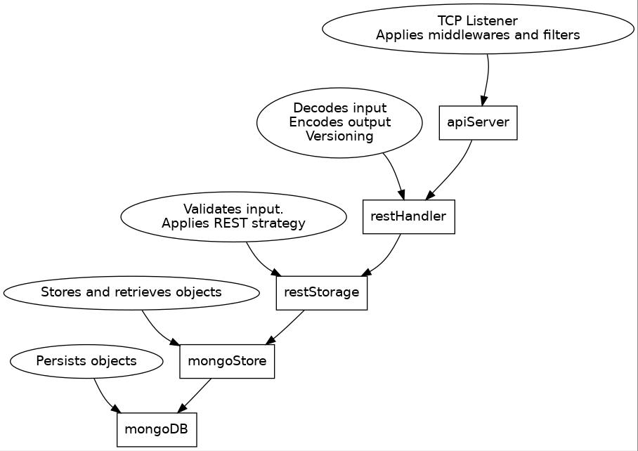
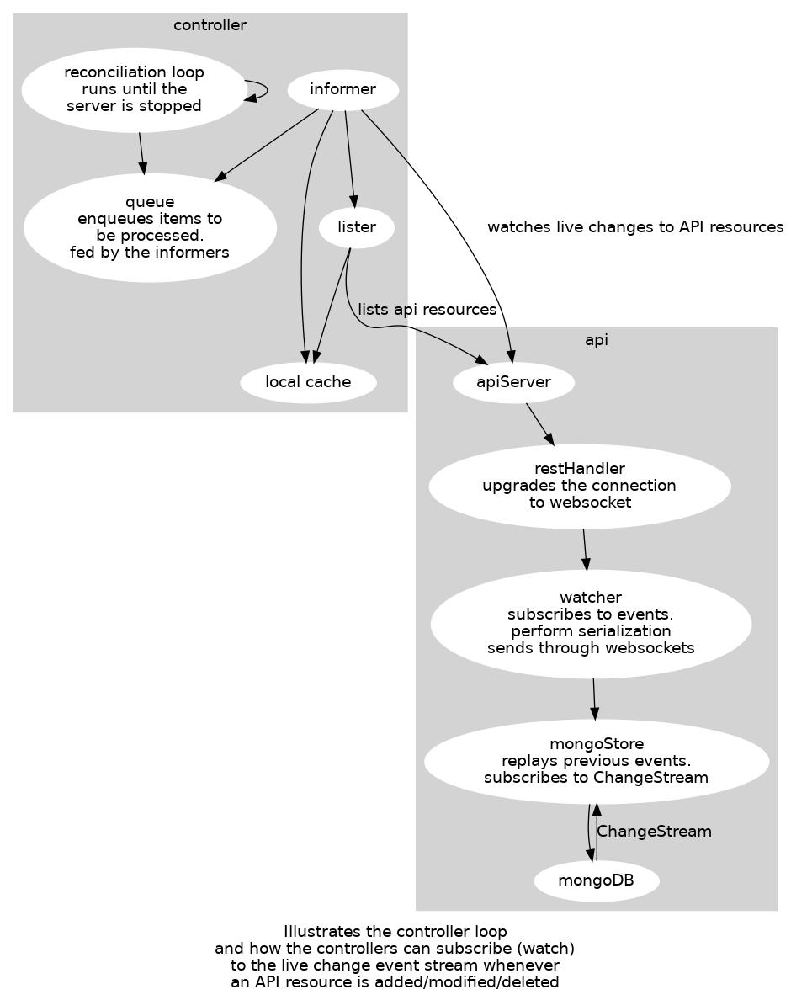

# nrc::core::api

### Case management API for Humanitarian Organizations

Part of the [NRC](http://nrc.no/) Core application. This project is the API layer for Core.

Humanitarian organizations often need to collect information about beneficiaries. Traditionnally, these organizations
use [kobo](https://github.com/kobotoolbox) or [ODK Central](https://getodk.org/) to do this. Though, these tools are not
well suited for beneficiary case management, but are rather designed for one-off data collection.

This project aims to solve some of the problems we identified with traditional beneficiary intake tools

### 1. Security & data compartmentalization

For large humanitarian organizations spanning multiple countries, it's essential that the field officers are only able
to access the data that they need. This project aims at providing the organization with customizable permission rules

For example, if a field officer needs to pull the beneficiaries information for offline use, he should only be able to
access that data.

### 2. Define and reuse data models

Organizations need to define the structure of the data they will collect. They often need to also reuse the same forms
throughout multiple campaigns. This project aims at providing the users a robust way of **defining** and **versioning**
data models throughout their lifecycle.

## Introduction

`Core API` is a RESTful API modeled closely on the `Kubernetes` apiserver. This API is designed to handle transparently
both statically typed data known at compile time, as well as custom data types known only at runtime. It is mainly used
as a data repository that allows custom RBAC/ABAC permissions, and that is tailored for the humanitarian sector usecase.

The reason for the need of **runtime data types** this is that the humanitarian sector works with various data models
that evolve over time. We can't realistically hardcode these different models, hence the need for a `generic` API that
can maintain these different data models. The `Kubernetes` `CustomResourceDefinitions` was a good fit for this.

We reused a lot of the packages published by the `Kubernetes` team, such as `apimachinery` which is used for versioning
of data models. One of the main differences is that we do not use `etcd`, but rather `mongoDB`. The reason for this is
that we will be handling potentially a very large amount of data, and we need to take advantage of db-side filtering.
`etcd` cannot do that, and would crash the server if it had to handle millions of records. We implemented a etcd-like
store using `MongoDB`, but that allow us to evaluate the filtering predicates on the database side, as well as use the
`WATCH` functionality using the mongoDB `ChangeStreams`.

## API Model Structure

Since we had to inherit from kubernetes `runtime.Object`, the structure of the API is very much similar to what you
would expect from a Kubernetes-flavored API.

#### Type Meta

```yaml
apiVersion: core.nrc.no/v1
kind: FormDefinition
...
```

the `apiVersion` represents the `Group` and `Version` of the endpoint we are interacting with.

The `Kind` if a user-friendly name for the resource

#### Metadata

```yaml
...
metadata:
  name: name-of-the-resource
  creationTimestamp: 2020-01-02:10:23:11.000Z
  labels:
    nrc.no/label1: value1
  annotations:
    nrc.no/annotation1: value2
...
```

The `metadata` contains additional information about a resource. It contains the `name` of the resource,
the `creationTimestamp` at which it was created. Additionally, it contains the `labels` and `annotations` which are
arbitrary key/value pairs used to identify/query resources. Application logic can use `labels` to tag resources for
various application concerns

#### Spec

```yaml
...
spec:
  someProperty: abc
  someOtherProperty: def
  nestedProperty:
    age: 3
...
```

The `spec` property contains the "bulk" of the data, or the "attributes"

#### Status

```yaml
...
status:
  conditions:
    - type: Approved
      status: "True"
      Reason: ...
      Message: ...
      LastTransitionTime: ...
  message: human readable message
  reason: CamelCaseReason
  someOtherStatus: true
```

Some resources implement the `status` property, which contain the current status of the resource. Since multiple
applications might interact with a single resource, they can use the `status.conditions` as a way to synchronize their
operations in a distributed way, or to simply implement their application concerns.

For example, if an organization requires that someone must manually approve a certain piece of data before it can get
processed any further, then it would be a good practice to model this approval in the resource `conditions`. Another
program might be waiting for that condition to be `True` before it processes the data. In a way, the `conditions` act as
a generic state machine.

## Concepts

### 1. `FormElement`

A `FormElement` represents a single **Form Control** or **Form Group**. There are different types of `FormElements`,
such as `text`, `longtext`, `checkbox`, `radio`, etc. Each `FormElement` also contains the validation rules for that
element, such as `required`, `minLength` etc.

If the `FormElement` is a `FormGroup`, then the `FormElement` contains `children`. These `children` are recursively
rendered inside the form.

Example

```yaml
type: text
required: true
key: firstName
```

### 2. `FormSchema`

A `FormSchema` lives inside a `FormDefinition`. A `FormSchema` represents both the **visual layout** and **logical
layout** of the form. The `FormSchema` contains the different visual elements that the end-user will see when filling
out a form. Each `version` of a `FormDefinition` will have it's own `FormSchema`

Example:

```yaml
name: v1
schema:
  root:
    type: section
    children:
      - type: text
        key: firstName
      - type: checkbox
        key: active
```

### 3. `FormDefinition`

A `FormDefinition` represents a user-defined form definition, along with all the different versions of that form. For
example, a `FormDefinition` will contain the `v1` `v2` and `v3` versions along with their `FormSchema`.

Example:

```yaml
kind: FormDefinition
apiGroup: core.nrc.no/v1
metadata:
  name: generalintakes.my.custom.group  // must be {pluralName}.{groupName}
spec:
  group: my.custom.group
  names:
    plural: generalintakes   // will be available at /apis/my.custom.group/{v1|v2}/generalintakes
    singular: generalintake
    kind: GeneralIntake
  versions:
    - name: v1
      schema:
        root:
          type: section
          children:
            - type: text
              key: firstName
    - name: v2
      schema:
        root:
          type: section
          children:
            - type: text
              key: firstName
            - type: text
              key: lastName
```

### 4. `CustomResourceDefinitions`

When the user registers a new `CustomResourceDefinition`, the `API` will expose a new endpoint corresponding to the
specifications of that definition.

For example, if a user creates a `CustomResourceDefinition` with group `acme.com` and name `hootnannies`, with one
version `v1`, then the API will expose the new following endpoints

```
GET    /apis/acme.com/v1/hootnannies
POST   /apis/acme.com/v1/hootnannies
GET    /apis/acme.com/v1/hootnannies/{name}
PUT    /apis/acme.com/v1/hootnannies/{name}
DELETE /apis/acme.com/v1/hootnannies/{name}
```

## Ideas for development

#### 1. Related entities

We need to be able to link pieces of data together, and provide an easy way for the user to link data together. For
example, when filling out a form called `VulnerabilityAssessment`, a user might want to be able to select which
beneficiary does this assessment relates to. Also, the person in charge of defining the forms should also be able to
easily add a field that allows the user to do such linkage.

For now, we have a handful of field types available such as `checkbox`, `shorttext` and so on.

We are thinking to introduce a field type `relationship` that would have the following structure

```
- type: relationship
  target:
    apiVersion: models.nrc.no/v1
    kind: Beneficiary
  displayValue: {.spec.lastName} {.spec.firstName}
```

That would allow the ui to easily be able to craft a `select` box that would be able to submit API request to the
desired `list` endpoint. The request would be in the form `apis/models.nrc.no/v1/beneficiaries`. The `select` control,
through convention and discovery, would know that the result is a list of type `BeneficiaryList`, and would know in
advance the json schema for that entity.

On the API side, when the user fills a form that contains a `relationship` field, and posts it to the API, there would
be a controller that would listen for incoming calls. The controller would walk through the POSTed object, detect the
relationships, and would append the given relationship to the related entity (in this case the `Beneficiary`). For
example:

```
apiVersion: models.nrc.no/v1
kind: Beneficiary
spec: 
 ...
status:
  relationships:
  - apiVersion: models.nrc.no/v1
    kind: VulnerabilityAssessment
    name: someform-a3214d-b213baf-231123d-adbawd
    fieldPath: .spec.beneficiary
```

When building the Beneficiary case management ui, it would be easy then to retrieve the associated models by simply
looking up the Beneficiary entity itself.

```
Beneficiary: John Doe
Vulerability Assessments:
- link to vulnerability assessment
```

### Architecture overview

#### Request path

The API server follows RESTful principles for the design of the API. Each resource **should** be able to be
created/updated/deleted independently.



#### Controllers

The `Controller` is the preferred mechanisms for reconciling application logic. Since they have to maintain a local
cache, they are suitable for relatively low-volume reconciliations.

Each controller is responsible for a **single resource**, or a **single aspect of a resource** in the API.

An example of such controller is the `FormDefinitionController`, that will
create/update/delete `CustomResourceDefinition`
that matches the created/updated/deleted `FormDefinition`.



For controllers that are expected to handle a large amount of data, and where the use of a local cache would consume too
much memory, then an alternative mechanism has to be used.

### Implementation details

This API leverages the work by the [kubernetes](https://github.com/kubernetes/kubernetes) team, especially around
the `apimachinery` package.

The storage is implemented using `mongodb`

It essentially is a very light version of the kubernetes `apiserver`.

1. The user defines a new form by submitting a `FormDefinition` to the API server
2. The `FormDefinitionController` detects a new `FormDefinition`, and will create a matching
   `CustomResourceDefinition`
3. The `CustomResourceDefinition` controller will expose an API endpoint at the address
   `apis/{formDefinition.spec.group}/{formDefinition.spec.version[].name}/{formDefinition.spec.names.plural}`
   For example, the api endpoint could be `apis/acme.org/v1/superforms`. This endpoint allows the usual `GET`, `POST`
   , `PATCH`, `PUT`

### How to start this thing

Requirements:

```shell
# requires go 1.16

# We depend on code that lives in the kubernetes/kubernetes
# github repo. It lives under the /staging/src/k8s.io, which
# is not importable by go modules. We then download it locally,
# and have the go.mod redirects to point to the correct directory.
# This will download kubernetes/kubernetes under /third-party 

./hack/update-deps.sh

# Add the following entries in your /etc/hosts

127.0.0.1 mongo1
127.0.0.1 mongo2
127.0.0.1 mongo3

# Download go modules
go mod download

# Set up go vendor directory
go mod vendor

# Starts mongodb
# Will be available at localhost:27017
# mongo-express available at localhost:8081
docker-compose -f ./docker/docker-compose.yaml up

# Starts the actual core api server
go run ./cmd/server \
  --mongo-servers "mongodb://localhost:27017,mongodb://localhost:27018,mongodb://localhost:27019" \
  --mongo-database dev \
  --bind-address "127.0.0.1" \
  --bind-port 8000

# Try the api a little bit
curl http://localhost:8000/apis/core.nrc.no/v1/formdefinitions -H "Accept: application/yaml"

```

### Example Form Definition

<details>
<summary>Example FormDefinition</summary>
<p>

```yaml
# example.yaml
---
kind: FormDefinition
apiVersion: core.nrc.no/v1
metadata:
  name: formtests.test.com
spec:
  group: test.com
  names:
    plural: formtests
    singular: formtest
    kind: FormTest
  versions:
    - name: v1
      storage: true
      served: true
      schema:
        formSchema:
          root:
            type: section
            children:
              - key: firstName
                label:
                  - locale: en
                    value: First Name
                  - locale: fr
                    value: Prenom
                description:
                  - locale: en
                    value: Enter the first name of the beneficiary
                  - locale: fr
                    value: Entrez le prénom du bénéficiaire
                type: shortText
                required: true
              - key: lastName
                label:
                  - locale: en
                    value: Last Name
                  - locale: fr
                    value: Nom de famille
                description:
                  - locale: en
                    value: Enter the first name of the beneficiary
                  - locale: fr
                    value: Entrez le nom de famille du bénéficiaire
                type: shortText
                required: true
```

</p>
</details>  

#### Post the example form definition

```shell
curl --data-binary @example.yaml http://localhost:8000/apis/test.com/v1/formtests -H "Content-Type: application/yaml"
```

<details>
<summary>Example form submission</summary>

<p>

```yaml
# submission.yaml
---
apiVersion: test.com/v1
kind: FormTest
metadata:
  name: example-form-submission
spec:
  firstName: Ludovic
  lastName: Cleroux
```

</p>

</details>

#### Post the form submission

```shell
curl --data-binary @submission.yaml http://localhost:8000/apis/test.com/v1/formtests -H "Content-Type: application/yaml"
```

#### Get the form submission

```shell
# Get
curl http://localhost:8000/apis/test.com/v1/formtests/example-form-submission | jq
# List
curl http://localhost:8000/apis/test.com/v1/formtests/ | jq
```

## Code Generation

This app supports code generation for

- Deepcopy funcs => Function that copies an object
- Conversion funcs => Converts an api object between version
- Defaulter funcs => Generates functions to apply defaults
- OpenAPI definitions => OpenAPI definition for api objects

That means that anytime you modify the source code comments for api objects, the `OpenAPI` documentation will be updated
as well.

For example

```go
package v1

type FormDefinition struct {
	// MyField is a field that is a field
	MyField string
}
```

If you change the comment for `MyField`, you should run `./hack/update-codegen.sh` to update the openapi definitions to
contain the new comments.

For this though, you **must** put the repository at

```
${GOPATH}/github.com/nrc-no/core
```

This is a current limitation of the `openapi-gen` package.

Then, you can run

```shell
./hack/update-codegen.sh
```
