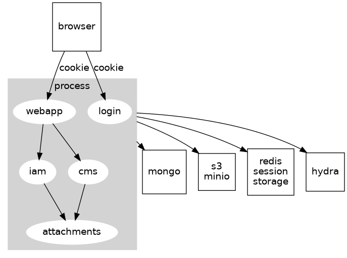

Core is written in go and uses server-side rendering via [go templates](https://golang.org/pkg/text/template/).


```
├── api                             # core lives here
│   ├── certs                       
│   ├── cmd                         # the package's root function
│   │   └── app
│   └── pkg                         
│       ├── apps
│       │   ├── cms                 # content management system (cases, case types, comments)
│       │   ├── iam                 # identity and access management (persons, relationships, teams, etc)
│       │   ├── login               # login front-end
│       │   │   └── templates
│       │   ├── seeder              # DB seeding
│       │   └── webapp              # main web frontend
│       │       └── templates
│       ├── auth                    # helper functions for authentication 
│       ├── generic                 # server struct abstractions
│       │   └── server
│       ├── middleware              
│       ├── rest                    # REST client
│       ├── server                  # main amd secondary servers
│       └── sessionmanager
├── artifacts                       # docker-compose configs
├── docs
└── e2e
    └── cypress
        ├── fixtures
        ├── helpers
        ├── integration             # e2e tests
        ├── pages
        ├── plugins
        ├── screenshots
        ├── support
        └── videos
```

#Data flow



1. The browser requests a webpage from `webapp`
1. If the user is not authenticated, the user is redirected to the `login` app
    1. the user provides credentials
    1. `login` app performs login flow with hydra. Performs oAuth redirect to `webapp`
    1. `webapp` stores session information in `redis`, populates session cookie
1. `webapp` verifies the authenticity of the access-token present in the session by calling `hydra`
1. `webapp` makes HTTP requests to any of `iam`, `cms` or `attachments` apps, forwarding the access-token using the `Authorization` header
1. `iam`, `cms`, `attachments` also verify the `Authorization` header passed by `webapp`
1. `iam`, `cms`, `attachments`, `login` can put/get data from mongo
1. `attachments` stores blob files in `s3` (photos, videos, pdfs, etc.)
