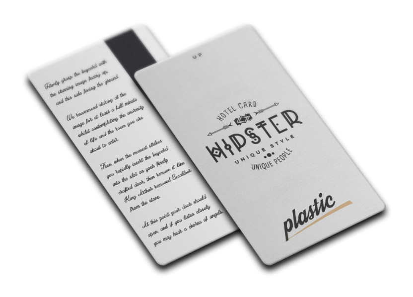

# Understanding Authentication and OAuth2

Basic OAuth2 terminology

User | Authorization Server | Token | Client |  Resource Server | Resource
---|---|---|---|---|---
 |  |  |  |  |  
 |  |  |  |  | 

## User

- Person

## Resource Server

A *Resource Server* is an application that contains protected resources (data, functionality)

- Hotel Room

## Resource Owner

A **Resource Owner** is a **User** that has some form of ownership or permissions on a **Resource**

- Hotel Owner

## Client

A **Client** is an **Application** that can access **Resources**
- on behalf of a **User**
- on behalf of itself

## Client

A **Client** represents an application that can be used to access protected **Resources** using **Tokens**. 

**Clients** can access resources ...

- on behalf of **Users**
- or in the case of background processes, **on behalf of themselves.**

In the *Hotel* metaphor, a **Client** could represent the *Hotel Card Readers* that can access *Hotel Rooms*
(**Resource**) by unlocking the *Hotel Door Lock* (**Resource Server**) using *Hotel Cards* (**Token**)
on behalf of *Guests* (**User**).

A **Background Client** could be a *Fire Alarm* that has permission to open all *Doors* (**Resource**). The *Fire Alarm*
does not act on behalf of a *Guest* (like the *Hotel Card Reader*), but on behalf of itself.

The application **AllMyPosts.com** would be a **Client** that could access posts on **Facebook** on behalf of the **
User**.

## Tokens

A **Token** is a digital key that proves that its holder (a **User**) was authenticated/authorized.

In the *Hotel* metaphor, a **Token** could represent a *Hotel Card* that allows its holder to access certain rooms. The

**Tokens** can be comprised of multiple parts

### Access Tokens

Grant the **Client** permission to access a **Resource** on behalf of the **User**. In the case of background
processes (APIs, background workers), then the **Clients** themselves are allowed to access resources (accessing
resource on behalf on themselves).

An **Access Token** is always bound to a single **Client**.

In the *Hotel* metaphor, it would grant the *Hotel Card Reader* (**Client**)
permission to unlock the *Lock* (**Resource Server**) to access the *Room* (**Resource**) on behalf of the *Guest*.

In other words, the *Hotel Card* (**Access Token**) carries the information that the *Hotel Desk* (**Authorization
Server**)
has granted the *Card Readers* (**Client**)
permission to unlock the *Room* (**Resource**)
on behalf of the *Guest* (**User**).

If John has rented *Room 8*, he cannot use his *Hotel Card* to access *Room 10*

*Hotel Card Readers* are not able to open *All Hotel Room Locks*, only the locks that the *User* can open. This is
becasue the *Hotel Card Readers* are acting on behalf of the *Users*.

Event if *John* would somehow add the permission *Open All Doors* on his hotel card, this would not give him actual
access to all *Rooms*, because he, himself, does not have access to all rooms.

*Hotel Card Readers* cannot open *Hotel Room Locks* without an *Hotel Card*

In this case, the **Access Token** given to the *Hotel Card Reader*
would only grant the following permission: **Open My Room**.

### ID Tokens

Only issued to authenticate **People** (not **Machines**). For example, an **ID Token** would prove that *John* was
authenticated through *Okta*

In the *Hotel* metaphor, it would represent a given *Hotel Card* was issued to *John Doe*

### Refresh Tokens

Grant its holder the permission to renew the ID/Access/Refresh Tokens.

There is no easy way to represent this in the *Hotel* metaphor.

**Refresh Tokens** are usually given to applications that need to maintain access to **Resources** without the presence
of the **User**. For example, *Twitter* (**Client**) could be allowed to create *Facebook Posts* (**Resource**) even
when the user is not logged in.  *Twitter* would need to keep a **Refresh Token** and use it to refresh the
**Access Token** before it expires.

### Revocation

**Tokens** expire after a certain time by design. This is a mechanism to be able to revoke access to **Resources**. In
order to be able to access a **Resource**, a **Client** would need to request a new set of **Tokens** before the
previous one expire. If user interaction is possible (**Clients** acting on behalf os **Users**), the **Client** can
simply prompt the **User** to authenticate again with the **Auth Server**. (This can be done silently, through
an `iframe` for example).

## Authorization/Authentication Server

An **Authorization/Authentication Server** is an application that can authenticate/authorize **Users** and **Clients**
and provide them with **Tokens**.

### Resource Server

A **Resource Server** is an application that can verify **Tokens** and serve **Resources**

In the *Hotel* metaphor, a **Resource Server** would be a *Door Lock* (**Resource Server**) that could verify *Hotel
Cards* (**Token**) and grant access to *Rooms* (**Resource**)

### Resource

A **Resource** is a piece of protected information or functionality.

### Authorization vs Authentication

There is a lot of confusion around these concepts, and these two concepts overlap to some degree. The general rule of
thumb is

**Authentication** is about assessing one's **Identity** 
**Authorization** is about assessing one's **Permissions**

