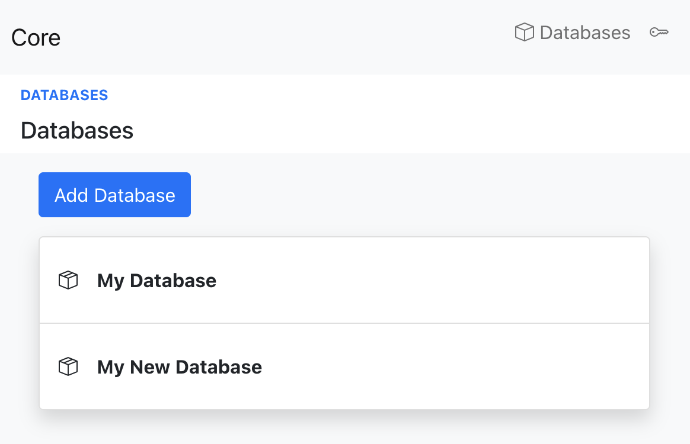

# How to add a new database?

## Navigate to the database list and click on `Add Database`

## Enter the new database name and click `Create New Database`

## You are redirected to the homepage of your new database

## Your new database will show up on the database list as well

## Done!
