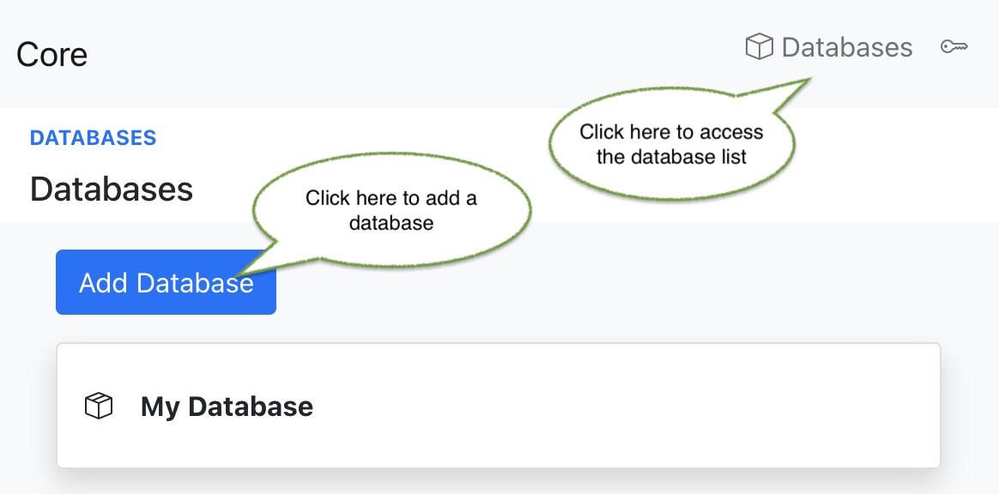
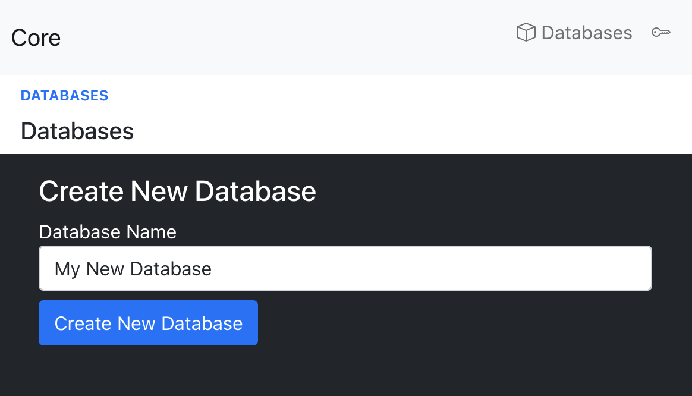
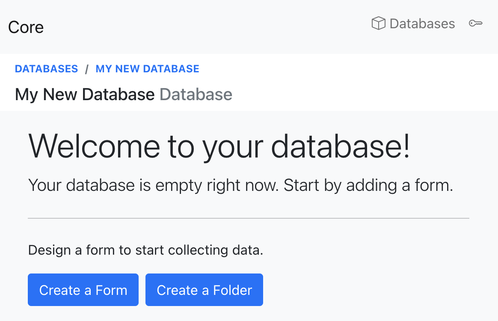

## How to add a database

1. Navigate to the database list and click on `Add Database`

2. Enter the new database name and click `Create New Database`

2. You are redirected to the homepage of your new database

