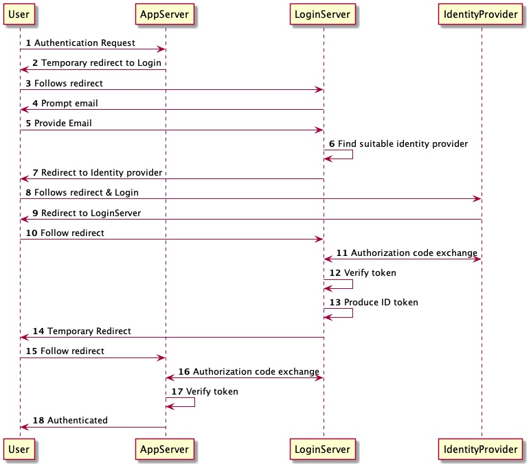

# Identity

Core allows staff from organizations to log in through their usual OpenID Connect provider (Okta, etc.). Often,
organizations require other users (collaborators, donors, external parties, beneficiaries) to have access to parts of
their system as well.

This document explains how Core handles such scenarios.

1. An organization is registered in **Core**. The organization is configured with an Identity Provider that corresponds
   to their **staff identity provider**.
2. An organization requires that an external person which is not part of their **staff identity provider** to contribute
   to their data. A member from the organization sends an invitation to the third party using Core.
3. The third-party collaborator receives the email invitation.
4. If the third party does not possess an account on **Core**, the third party will be prompted with a dialog to
   register an account.
5. If that person already has an account on **Core**, then the user can accept the invitation from the organization.
6. **Core** is configured so that certain email addresses match certain organizations, and redirect them to the proper
   Identity Provider. For example, emails ending in **nrc.no** will have to login through the **Norwegian Refugee
   Council** identity provider. If the email of that third party matches one of the configured emails, then that person
   must login through that identity provider. Otherwise, that person will need to create an account with an
   email/password.
7. All user accounts directly provisioned through email/password are global. They would be shared between multiple
   organizations.

Note that inviting a person to an organization does not grant that person any access out of the box. Access to specific
resources will have to be provisioned separately.

That is a great usecase for authenticating external donors, partners, lawyers, specialists, or beneficiaries to certain
parts of the system.

Example **Organization** <-> **External Person**

1. Organization **NGO A** is registered on **Core**. Emails with domain **xxx@ngoa.com** are configured to login with an
   identity provider **Okta**. **Alice** is the **administrator** of **NGO A**
2. Organization **NGO A** requires **John** to have access to some documents. **Alice** uses **Core** to send an
   invitation to **John** to join the **NGO A** organization. **Alice** can speficy that **John** should only have
   access for a specified period of time (1 month)
3. **John** receives an email in his **john@gmail.com** inbox to join **NGO A** on **Core**
4. **John** clicks on the link, and is prompted with a **Sign Up** screen. **John** fills up the necessary information.
5. **John** sees the invitation from **NGO A** and accepts to collaborate.
6. **John** is now part of the **NGO A** organization.
7. **John** can leave **NGO A** at any time.
8. **NGO A** can remove **John** as a collaborator at any time.

Example **Organization** <-> **Organization**

1. Organization **NGO A** is registered on **Core**. Emails with domain **xxx@ngoa.com** are configured to login with an
   identity provider **Okta**. **Alice** is the **administrator** of **NGO A**
2. Organization **NGO B** is registered on **Core**. Emails with domain **xxx@ngob.com** are configured to login with an
   identity provider **Github**. **Bob** is the **administrator** of **NGO B**
3. **Alice** needs **Mark**, a member of **NGO B**, to collaborate with **NGO A**.
4. **Alice** uses **Core** to invite **Mark** to join **NGO A** by sending an invitation. Since the collaboration is
   temporary, **Alice** specify that **Mark** should only be allowed to collaborate for the next 2 months.
5. Since **Mark** has an email **mark@ngob.com** that is already configured on **Core** for **NGO B**, he receives an
   invitation to join **NGO A**. Mark does not need to signup on **Core** since he already has an account.
6. **Mark** approves the invitation from **NGO A** and can now collaborate.
7. **Mark** can leave the **NGO A** organization at any time.
8. **Alice** can remove **Mark** as a collaborator of **NGO A** at any time.
9. After 2 months, **Mark** can no longer collaborate with **NGO A** since the specified 2 month period has elapsed.

## User Login Sequence

